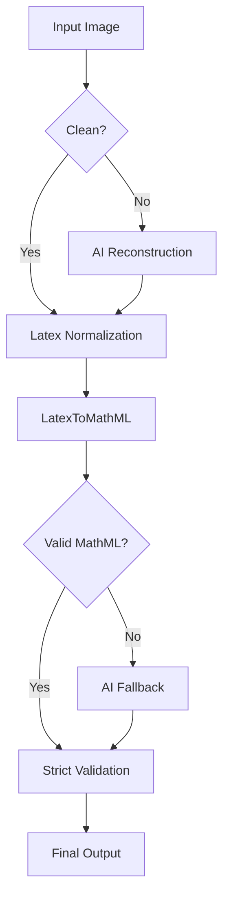
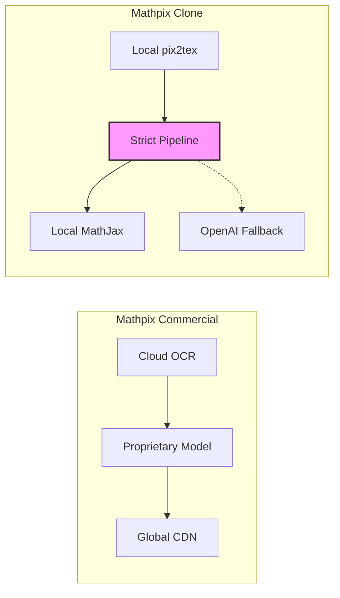

# Mathpix Clone: Project Analysis & Feature Comparison

## 1. Project Overview

**Mathpix Clone** is a desktop application designed to emulate the core functionality of Mathpix Snip: converting images (screenshots or PDFs) of mathematical equations into digital formats like LaTeX and MathML. It emphasizes a "Strict Pipeline" approach to ensure high-fidelity, semantically correct output, leveraging a hybrid of local OCR models and AI-powered correction.

### 1.1 Core Architecture

The application is built using **Python** and **PyQt6** for the frontend, with a modular backend service architecture.

*   **Frontend (UI):**
    *   **Main Window:** Central hub managing navigation and global state.
    *   **Snip Tool:** Screen capture overlay (`bounding_overlay.py`) for selecting regions.
    *   **Preview Panel:** Real-time rendering of equations using `MathJax` within a `QWebEngineView`. It provides immediate visual feedback and validation status.
    *   **PDF Viewer:** Integrated PDF handling for page-level OCR.
    *   **History & Snips:** Persistence layer to browse past extractions.

*   **Backend (Services):**
    *   **OCR Service (`services/ocr`):** The heart of the application.
        *   **Engine:** Uses `Pix2Tex` (LaTeX-OCR) for primary image-to-LaTeX conversion.
        *   **Strict Pipeline:** A multi-stage processing pipeline ensuring data integrity.
    *   **Persistence:** Local database/file storage for history.
    *   **Exporters:** Capability to export data (logic implied by directory structure).

### 1.2 The "Strict Pipeline" Flow

The project distinguishes itself with a rigorous processing pipeline (`StrictMathpixPipeline`):

1.  **Extraction (OCR):**
    *   Input image is processed by `Pix2Tex`.
    *   Outputs raw LaTeX string.
2.  **Corruption Detection:**
    *   **Regex Checks:** Scans for common OCR artifacts (e.g., `s_u_m` instead of `\sum`, `l_e_f_t` instead of `\left`).
    *   **AST Analysis:** Checks for malformed structures.
3.  **AI Repair (Conditional):**
    *   **Gatekeeper:** AI (OpenAI GPT-4o-mini) is *only* invoked if corruption is detected.
    *   **Role:** Strictly limited to semantic LaTeX reconstruction. It is forbidden from hallucinating math or paraphrasing.
4.  **Normalization & Validation:**
    *   **Syntax Check:** Verifies balanced braces, valid commands.
    *   **Standardization:** Normalizes commands (e.g., `\stackrel` handling) for consistent properties.
    *   **Truncation Detection:** Checks for cut-off equations and attempts auto-repair or flagging.
5.  **Conversion (LaTeX → MathML):**
    *   **Deterministic Converter:** Uses `latex2mathml` (or custom wrapper) to generate Presentation MathML.
    *   **Structural Fixes:** Post-processing to ensure deeply nested structures (matrices, limits) render correctly (e.g., converting invalid entities, fixing `mtable` structures).
6.  **Strict MathML Validation:**
    *   **Zero Tolerance:** Validates against W3C standards.
    *   **Sanity Checks:** Rejects "spelled out" words in math tags (e.g., `<mi>s</mi><mi>u</mi><mi>m</mi>`).

## 1.3 Visual Architecture

### Strict Pipeline Flow

### Mathpix vs. Clone Architecture

## 2. Feature Comparison: Mathpix vs. Mathpix Clone

| Feature | Mathpix (Commercial) | Mathpix Clone (This Project) |
| :--- | :--- | :--- |
| **Core OCR Engine** | Proprietary Cloud-based AI (Deep Learning). Extremely fast and accurate on diverse fonts/handwriting. | **Pix2Tex (Local)** + **OpenAI (Cloud Fallback)**. Good for standard print; heavily reliant on AI repair for complex/corrupted inputs. |
| **Processing Model** | Cloud-first (mostly). | Hybrid (Local Code + Cloud AI for repair). |
| **Equation Support** | Extensive (Inline, Block, Tables, Chemistry, matrices). | **Strong**. Enhanced by "Strict Pipeline" to handle complex multiline cases (`align`, `cases`) and matrices effectively. |
| **Output Formats** | LaTeX, MathML, Markdown, MS Word, SMILES, ChemDraw. | **LaTeX, MathML**. (Likely Markdown via exporters). |
| **Handwriting** | Excellent support. | Limited (Dependent on Pix2Tex capabilities, which focuses on printed LaTeX). |
| **User Interface** | Minimalist Tray App + Web Dashboard + Mobile App. | **Rich Desktop App**. Full sidebar navigation, built-in PDF viewer, history management, and detailed debug/preview panels. |
| **Feedback Loop** | Instant copy-paste. | **Preview & Validation**. Shows rendered "Confidence" and "Validation Status" (Valid/Invalid) to the user. |
| **PDF Processing** | Full document conversion (PDF to DOCX/Markdown). | **Page/Region based**. Users select pages or regions to digitize. |
| **Confidence/Debug** | Mostly opaque "it just works". | **Transparent**. Exposes internal confidence scores, potential errors, and raw MathML for debugging. |

## 3. Gap Analysis & Recommendations

### 3.1 Gaps
*   **Speed:** The multi-stage pipeline (especially if AI fallback is triggered) introduces latency compared to Mathpix's near-instant results.
*   **Offline Capability:** While Pix2Tex is local, the critical repair capabilities rely on OpenAI, limiting true offline robustness for complex math.
*   **Handwriting:** Native Pix2Tex may struggle with handwriting compared to Mathpix's specialized models.
*   **Full Document Export:** Mathpix shines in converting whole PDFs to editable formats preserving layout. This clone appears focused on snippet-level extraction.

### 3.2 Strengths of the Clone
*   **Control:** The "Strict Pipeline" gives strict guarantees structure. If it says "Valid", it complies with web standards.
*   **Transparency:** Great for R&D or QA usage where knowing *why* OCR failed is important.
*   **Cost:** Uses local compute for the "happy path", reducing API costs compared to processing everything in the cloud.

## 4. Current Workflow Status
The project is currently in a **stabilization phase**.
*   **Recent Fixes:** Addressed race conditions in rendering (`PreviewPanel`), fixed invalid XML entity generation in AI fallback, and improved truncation detection.
*   **Focus:** Ensuring the "Strict Pipeline" does not produce invalid MathML that crashes the UI.

This architecture offers a robust foundation for a high-accuracy, controllable math extraction tool, prioritizing correctness over raw speed.

## 5. PDF Review: Gap Analysis & Recommendations (Test Case: 1300000044.pdf)

### 5.1 Complex Structure Handling
The analyzed PDF contains advanced mathematical structures (Calculus, Signal Processing) such as:
- **Nested Subscripts**: $T_{s_{1},1,s_{1},2,\cdots,s_{K,K}}$
- **Stacked Operators**: $\stackrel{\longrightarrow}{i,j \leq K}$
- **Formatting Mixing**: $\bf{1}$ vs $\mathrm{SNR}$

**Gap**: While `LatexToMathML` handles `\bf` and `\mathrm` correctly (verified), visually complex stacks using `\stackrel` instead of `\xrightarrow` or `\lim` may render suboptimally in pure MathML compared to LaTeX.
**Recommendation**: Implement a semantic normalization step to convert visual hacks like `\stackrel{\longrightarrow}` into semantic equivalents `\xrightarrow`.

### 5.2 Domain-Specific Semantics
The document uses "SNR" which needs to be preserved as a single entity, not $S \times N \times R$.
**Gap**: Current fallback might split these if not explicitly wrapped in `\mathrm`.
**Recommendation**: Enhance `_normalize_latex_semantics` to detect and wrap common technical acronyms (SNR, SINR, MSE) in `\mathrm{}` automatically.

### 5.3 Performance
Processing complex pages takes ~8-9s.
**Recommendation**: Implement caching for detected text blocks to avoid re-processing identical headers/footers in PDFs.
